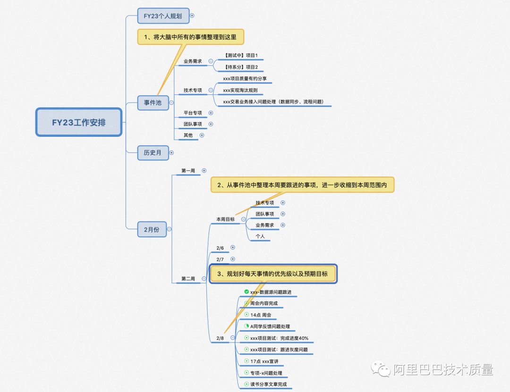

阿里QA导读：忙忙碌碌的一天又过去了，我们该如何掌控好自己的时间。今天分享一本时间管理秘籍---《搞定》，快来一起了解下GTD时间管理大法吧。

一、导读
“工作会自动膨胀，直到占据你所有的时间”。在快节奏的互联网行业中，作为知识型工作者，我们每个人手上都堆积着大量的事件要处理：

业务需求：

需求评审

系分评审

测分评审

代码CR

项目测试

发布回归

基础建设

环境建设

工具建设

数据建设

自动化建设

组内工作

答疑

授教

会议

外部支撑

其他事项：突然事情、老板的事情、自己萌发想做的事情等等

       忙忙碌碌一天下来工作效率大大折扣，时间都不知道花到哪里了。相信很多人都存在这个困惑，做一件事时想到另外一件事或者被其他事情打乱节奏，如果你也存在这种情况建议精读这篇文章，一定会对你有所帮助。

       “混乱不是问题，关键在于需要多久时间才能发现其内在的相关性”。今天分享的这本时间管理秘籍《搞定》就是帮助我们解决时间混乱问题。这里面提到的方法，刚开始我是模仿着做，现在经过两年的沉淀已经变成了我的一个工作习惯和工作方式，这对我理清工作、提高工作效率非常有帮助。

时间管理的三大误区

不可能把5分钟变成6分钟

不可能管理大量的信息，过量的信息只会被遗忘或忽视

不可能管理事务的优先级，因为事务是否优先完全是你的主管决定

学习时间管理，首先我们要建立好自己的预期值，如果一开始预期就错了，时间也就白费了。不要指望通过时间管理实现用5天的时间做完6人日的活，这意味着我们对时间管理的目标应该是极大可能提升时间利用效率。

       之前看到“时间密度”这个词，它说得是通过降低时间密度来提升时间利用效率，越成功的人时间密度越小。举一个常见的例子：我们找同学帮忙看个问题，A同学说今天晚点给你看下（时间密度为天，时间的安排以天为单位），B同学说下午3点给你看下（时间密度为小时）。我们细品下A、B两位同学对时间的掌控力，这表现了B同学对时间的精打细算（并不绝对，大家理解意思即可）。对时间越“精打细算”，你的时间利用效率就会越高。通过对这本书的学习，它也教会我了如何掌控好自己的时间，毕竟人的一生只有300个100天。

二、GTD概述
       GTD是英文“Geting Things Done”的缩写，它已经成为时间管理领域的一个专有名词。这本书提供了一个新思维方式：时间管理不是不断压缩，而是管理内心的焦虑和精神负担。

       GTD核心理论是通过外部工具解除精神负担，保持大脑的轻松愉快。备忘录、时间表、日程表、工作计划进行时间管理的根本目的是通过外在工具和技术，将那些让你心烦意乱的工作安排从大脑的移除出去，保持大脑的轻松愉快，以良好的状态面对一项项的工作计划。

我认可GTD的理论，在于我感觉围绕时间的话题最终都能指向这个源头：

番茄时钟法。它的工作方法是25分钟一个循环，将事情进行拆解，20分钟内专心解决一件事再休息5分钟。本质上还是让大脑在20分钟内不要有其他负担。

心流状态。每个人都应该有过这个状态，在这种状态下我们会感觉时间不知不觉就不够用了，我们的大脑高度集中，以至于我们写出来的文档、开发出来的代码都格外的好。达到心流状态就是最高工作效率的体现，它一定是要大脑高度集中，排除其他一切杂乱思想。

工作心烦意乱的根因。其实我们往往焦虑不是来源于事情多。即使事情再多，如果我们每天能专心做几件事我们不会感到烦躁。正在焦虑的来源于在我们干一件事情的时候，往往想着还有其他事情，或者突然被其他事情打断，打破了自己的“承诺”而感到焦虑。

       GTD提供了它自己的一套方法，帮助我们解除精神负担。例如「横向管理工作流程的5个步骤」、「纵向管理项目的5个阶段」。我不会详细介绍每个详细方法的概述，我会更多通过自己的实践来表述我对GTD的理解，感兴趣大家可以找这本书来仔细阅读下。我从GTD中学到的最重要的工作方式在于下面两点

昨天的工作任务一定要按计划完成，除了那些自己不能控制的特殊情况以外，不应该留下尾巴

将今天的任务整理的工作计划中，特别注意的是一定要清晰、明确、具备结构性

       这两个工作方式本身是有难度的，一方我们总会给自己设定各种要做的事情，另外一方面每天就是存在一些事情过来干扰到你的计划。接下来我将把自己的实际经验分享给大家。

三、两年经验分享
1. 安排好自己每天的时间
       做时间的主人，妥善安排好自己的时间。这不需要我们额外投入过多的精力，可能1分钟或5分钟就能收到意想不到的效果。以我自己来说，每天到公司，我一般不会立即投入到具体的细节事情，而是会用3分钟先收集下大大小小的事情，做好一天的工作规划。这里说的大大小小的事情包含所有的事情，例如具体的项目（进行中的、未来的）、团队事项、技术专项、今天的想法、私人的事情等等。我自己的收集事件的原则有两个 ：

原则一：事无巨细。将所有的事情从大脑中清除干净，确保自己在做某件事情的时候大脑是轻松愉快的专注在一件事情上；

原则二：表达清晰。整出来的事情要按照一定的结构归纳整理，要能达到看到这些事情就知道自己要做哪些事情，不要再给自己多余思考的机会，如果自己还要思考就是给大脑徒增烦恼。

       首先，我会设置自己的事件池，只要是事情都会“扔在这里”，将它们从大脑的清除（如下图所示）。

       其次，每周一我会把事件池中的事项依据优先级、重要程度、投入工作量综合考量设定本周的工作规划。具体到每一天要做什么的时候就不再关注事件池，而关注更小范围周目标。

       最后，每天我会根据优先级设置好今天要做的事情，通常我设置的事项会比较多，但是我自己会有一个预期，不会强制自己全部处理完成。如何设定工作事项的优先级，我有自己的三个原则：

原则一：今日明确的事件优先固定下来（例如会议），然后再合理规划自己的时间分配。例如下午3点-4点有个会议，那我会将一个大概1小时内能办成的事情放到下午2点-3点；

原则二：将30分钟内能完成的事情优先级提前。个人实践证明当清单上完成的事情越多，我会越有满足感，感觉自己收获满满，这会带来工作的热情最终会转化成工作效率；

原则三：最高效的时间段留给最难解决的事情上。例如我晚上的专注度比较高，我会把一些需要思考的事情留到晚上来执行。

       经过这样的整理，大家会发现对于我来说，我不需要在脑子中时常记着我还有哪些事情要做，这么多要做的事情先做哪个再做哪个。我脑子很清晰，今天就干这几件事情，按照上面的优先级来完成就行。

2. 如何应对临时插入的事情

       今天规划要完成的事情，往往不如我们所愿，因为我们肯定会被临时的事情干扰。针对临时过来的事情，我一般也会有三个处理原则：

原则一：将手头的事情完成到一个能快速拉起的状态。例如：在撸代码的过程中，老板的临时任务安排过来了，此时最好是花几分钟能将你的代码逻辑写到一个可以快速恢复的状态。等下次重新进入到这项工作时，不要在重新回顾。有点像CPU上下文切换，只有切换足够快性能才够足够好。要想快速切换，就要把一件事情完成到一个可随时切换的场景。这里需要有意识的去做，这个也并不是说让老板再等10分钟，经常我自己的切换可能在1分钟内就能完成。

原则二：两分钟内能解决的事情尽量处理，不拖拉。2分钟能完成的事情如果不及时清理，会一直留在你脑子中挥之不去，及时清理有助于大脑轻松愉快。

原则三：识别重要程度分优先级。非重要的事情我不会安排到今天执行，但这个事情产生了我会把它扔到事件池中或者周目标中，然后今天不再管。这么做的好处在于，我不会再突然某个时刻去想我还有这个事情需要去做，明天要什么时候做，保持大脑的清洁、等到第二天再来重新规划事情优先级。

3. 应对焦虑之源
       做好了时间的规划和突发事件的应对，我们还没法做到“心如止水”。因为总会存在一些困难的事务需要大量的时间和精力去应对。大脑本来就不想多思考，所以很多情况下我们都会拖到最后一刻来处理，这是大脑的本能。GTD中阐述了真正让我们焦虑的是我们为无法按照预期完成交付而感觉焦虑，仔细想想确实是这样的。这样的事情出现1、2件，这些事情一直会萦绕在我们的脑海中挥之不去。我们会感觉到时间不够用了，感到焦虑了。事情处理完成后，我们又会感到无比轻松。

针对这种费脑子的事情，结合GTD的方法，我总结了三点跟大家分享：

全局时间规划：还是之前说的，往往我们不是处理一件事。如果只有一件费脑子的事情，我们专心完成就行了，可能也不会焦虑。现实的情况是费脑子的事情需要一段长时间不被打扰的时间段进行处理，同时又有其他事务进行干扰。所以我们要学会做全局时间的规划，对费脑子的事情作出合理的“时间承诺”。例如我对自己承诺周三下午到晚上完成这篇文章。周三之前我应该清理其他阻塞我承诺的其他事务，同时在周三之前我不会在脑海中突然再想起写文章这件事。如果期间出现了突发事件，就按照第二点中的按照优先级、重要程度、时间消耗重新规划。

复杂事情拆解：还有一种费脑子的事情可能是个长达数日才能完成，如果我们脑中一直想着方案、规划、进展、风险会非常的痛苦，我一般会把复杂的事情进行拆解。例如一个大的功能开发，我会拆解到每个细节点，然后分配到每周目标去完成，大事务切割、化繁为简。

及时复盘清理：清理是GTD的关键词，将一切需要思考的事情清理出我们的大脑。一件复杂的事情需要及时复盘清理，原来这件事情可能是西瓜大小，经历过一段时间处理后及时清理就变成了一个苹果大小，复杂的事情也就变简单了。

       时间管理是一门很大的学科，GTD的时间管理方法最重要的技巧就是把一切事务赶出大脑，我认为最重要的还是实践，在实践中逐渐找到自己的工作方式和习惯。赶快行动起来，开始就意味着成功了一半，希望这篇文章对大家有帮助！

